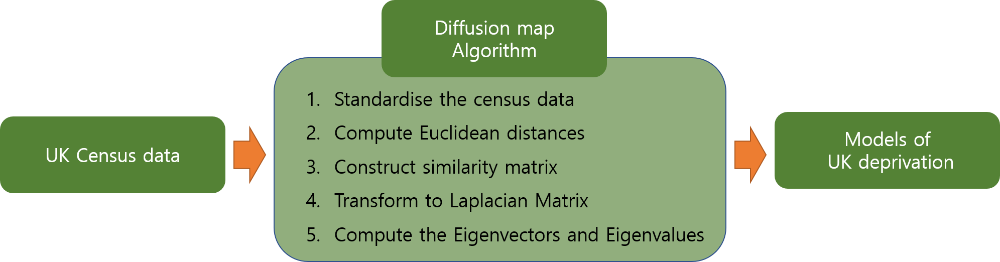
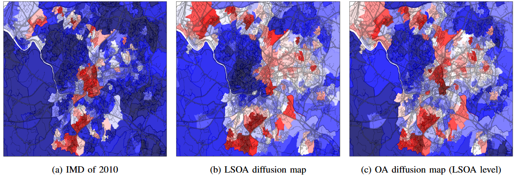

# Data-Driven Socio-Economic Deprivation Prediction via Dimensionality Reduction: The Power of Diffusion Maps
**Accepted to 2024 IEEE International Conference on Big DATA (ABCSS)**
**Reference**:
```

```
## Abstract
This research proposes a model to predict the location of the most deprived areas in a city using data from the census. Census data is very high-dimensional and needs to be simplified. We use the diffusion map algorithm to reduce dimensionality and find patterns. Features are defined by eigenvectors of the Laplacian matrix that defines the diffusion map. The eigenvectors corresponding to the smallest eigenvalues indicate specific characteristics of the population. Previous work has found qualitatively that the second most important dimension for describing the census data in Bristol, UK is linked to deprivation. In this research, we analyse how good this dimension is as a model for predicting deprivation by comparing it with the recognised measures. The Pearson correlation coefficient was found to be greater than 0.7. The top 10 per cent of deprived areas in the UK, which are also located in Bristol, are extracted to test the accuracy of the model. There are 52 of the most deprived areas, and 38 areas are correctly identified by comparing them to the model. The influence of scores of IMD domains that do not correlate with the models and Eigenvector 2 entries of non-deprived Output Areas cause the model to fail the prediction of 14 deprived areas. The model demonstrates strong performance in predicting future deprivation in the project areas, which is expected to greatly assist in government resource allocation and funding.

## Methodology


## Results

